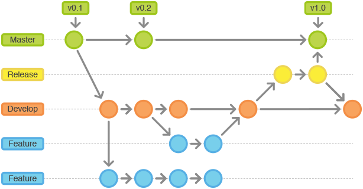

2017-03-14 17:25
创建develop版本,用来发布到测试上

---

# 1. 新增自描述文件

2017-03-14 17:00

---

# 如何管理我们的分支

## Git常用的分支

### Master 分支
也就是我们经常使用的Master分支，这个分支最近发布到生产环境的代码，最近发布的Release， 这个分支只能从其他分支合并，不能在这个分支直接修改

### Develop 分支 - 【送测版本】
这个分支是我们是我们的主开发分支，码包含所有要发布到下一个Release的代，这个主要合并与其他分支，比如Feature分支。这个版本送测。

### Feature 分支
这个分支主要是用来开发一个新的功能，一旦开发完成，我们合并回Develop分支进入下一个Release

### Release分支 - 【上线版本】
当你需要一个发布一个新Release的时候，我们基于Develop分支创建一个Release分支，完成Release后，我们合并到Master和Develop分支

### Hotfix分支 - 【热修补版本】
当我们在Master发现新的Bug时候，我们需要创建一个Hotfix, 完成Hotfix后，我们合并回Master和Develop分支，所以Hotfix的改动会进入下一个Release

---

## 初始分支Master

所有在Master分支上的Commit应该Tag

---

## Feature 分支

分支名 feature/*

Feature分支做完后，必须合并回Develop分支, 合并完分支后一般会删点这个Feature分支，但是我们也可以保留

---

## Release分支

分支名 release/*

Release分支基于Develop分支创建，打完Release分之后，我们可以在这个Release分支上测试，修改Bug等。同时，其它开发人员可以基于开发新的Feature (记住：一旦打了Release分支之后不要从Develop分支上合并新的改动到Release分支)

发布Release分支时，合并Release到Master和Develop， 同时在Master分支上打个Tag记住Release版本号，然后可以删除Release分支了。

## 维护分支 Hotfix

分支名 hotfix/*

hotfix分支基于Master分支创建，开发完后需要合并回Master和Develop分支，同时在Master上打一个tag

